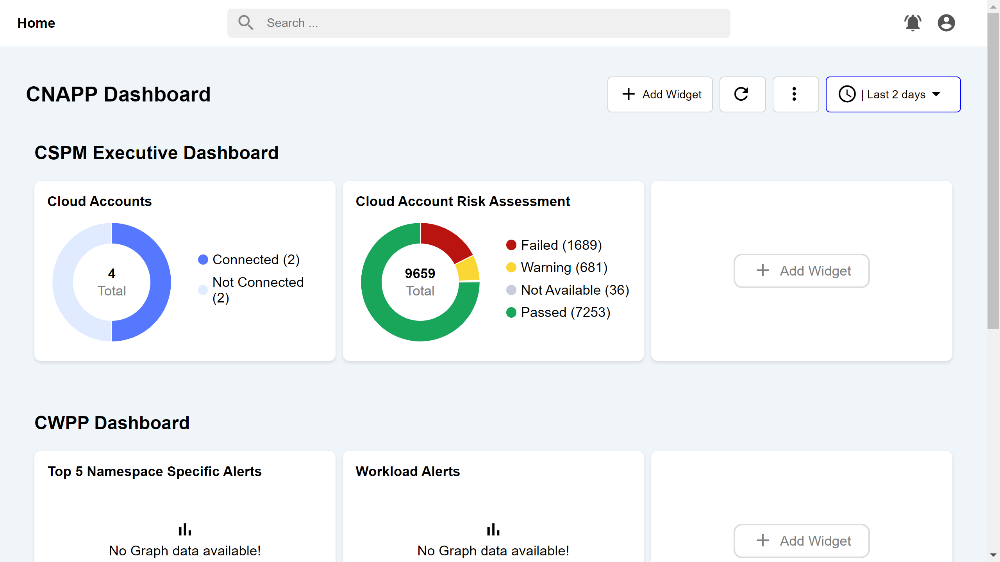
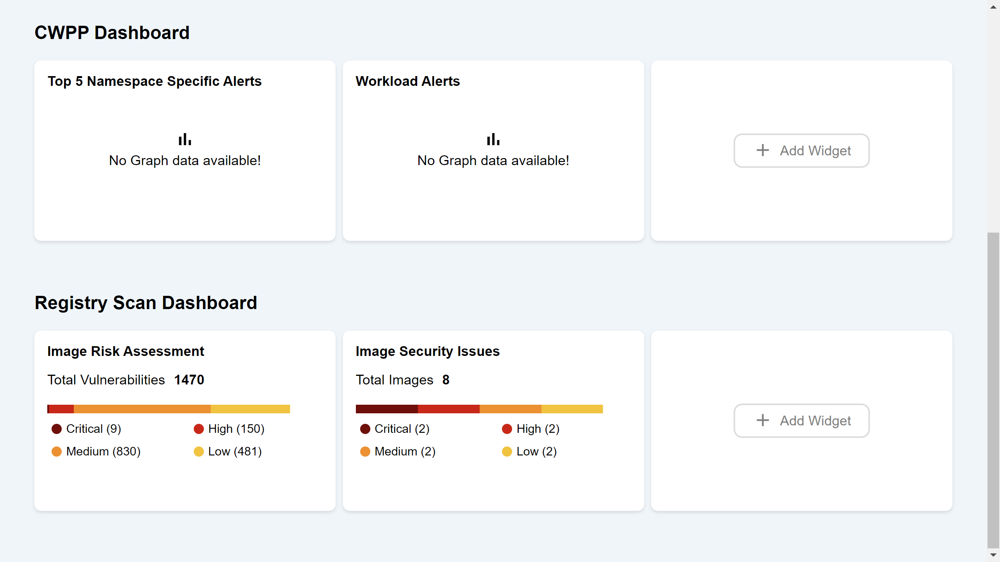
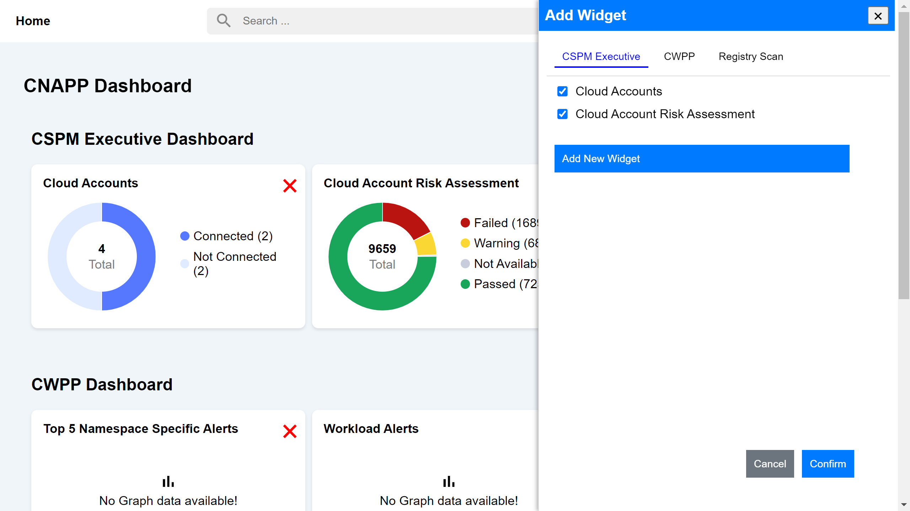

# React-Dashboard-App
This project is a React-based dashboard application with various components for managing and displaying widgets. The application includes features for adding, removing, and viewing widgets, along with interactive charts and a customizable dashboard.

## Screenshots





## Project Stucture
```bash
/src/
├── components/
│   ├── AddWidgetWindow.jsx           # Component for adding widgets
│   ├── AddWidgetButton.jsx           # Component for the 'Add Widget' button
│   ├── CSPMExecutiveDashboard.jsx    # Component for the CSPM Executive Dashboard
│   ├── CWPPDashboard.jsx             # Component for the CWPP Dashboard
│   ├── DashboardHeader.jsx           # Component for the dashboard header
│   ├── DashboardPage.jsx             # Component for the main dashboard page
│   ├── DoughnutChart.jsx             # Component for rendering doughnut charts
│   ├── RegistryScan.jsx              # Component for the Registry Scan dashboard
│   └── Header.jsx                    # Component for the application header
├── css/
│   ├── AddWidgetWindow.css           # Styles for the AddWidgetWindow component
│   ├── AddWidgetButton.css           # Styles for the AddWidgetButton component
│   ├── CSPMExecutiveDashboard.css    # Styles for the CSPMExecutiveDashboard component
│   ├── CWPPDashboard.css             # Styles for the CWPPDashboard component
│   ├── DashboardHeader.css           # Styles for the DashboardHeader component
│   ├── DashboardPage.css             # Styles for the DashboardPage component
│   ├── DoughnutChart.css             # Styles for the DoughnutChart component
│   ├── RegistryScan.css              # Styles for the RegistryScan component
│   ├── App.css                       # General application styles
│   └── Header.css                    # Styles for the Header component
├── redux/
│   ├── saveToFile.js                 # Utility for saving data to a file
│   ├── store.js                      # Redux store configuration
│   └── widgetSlice.js                # Redux slice for managing widgets
├── App.js                            # Main application component
├── index.js                          # Entry point for React application
└── index.css                         # Global styles for the application
```
## Prerequisites

Ensure you have the following installed:
- [Node.js](https://nodejs.org/) (v14 or later)
- [npm](https://www.npmjs.com/) (comes with Node.js)

## Getting Started

Follow these steps to set up and run the application locally:


### 1. Clone the Repository

First, clone the repository to your local machine:
```bash
git clone https://github.com/mevamsireddy/React-Dashboard-App.git
```
### 2. Navigate to the Project Directory
Change to the project directory:
```bash
cd React-Dashboard-App
```
## Required Modules

The following modules are required for the application. Ensure you have these installed to run the application correctly.

### 3. Install Dependencies

- **React and React-Redux**
  - `react`: The core library for building user interfaces.
  - `react-redux`: Provides bindings for using Redux with React.

- **Redux Toolkit**
  - `@reduxjs/toolkit`: Provides utilities to work with Redux, including `createSlice`.

- **Chart.js and react-chartjs-2**
  - `chart.js`: A library for rendering charts and graphs.
  - `react-chartjs-2`: React wrapper for Chart.js, allowing you to use Chart.js components within React.

- **Material Icons**
  - You need to include Material Icons in your HTML for icon usage.

### Installation Instructions

To install the required modules, follow these steps:

1. **Install React and Redux-related packages:**

   Using npm:

   ```bash
   npm install react react-redux @reduxjs/toolkit

2. **Install Chart.js and react-chartjs-2:**

   Using npm:

   ```bash
   npm install chart.js react-chartjs-2

3. **Add Material Icons to your HTML:**

   Include the following link tag in your public/index.html file within the <head> section to use Material Icons:

   ```bash
   <link href="https://fonts.googleapis.com/icon?family=Material+Icons" rel="stylesheet">

### 4. Prepare JSON Data
Ensure that the widgets.json file is located in the public directory. This file is used to fetch and display widget data in the application.

### 5. Running the Application
To start the application on your local machine, run the following command:
```bash
npm start
```
This will start the development server and open the application in your default web browser. The application will be available at http://localhost:3000.

Acknowledgments
- React: For providing a powerful library for building user interfaces.
- Redux Toolkit: For simplifying state management in React applications.
- Chart.js: For creating beautiful charts and graphs.
- Material Icons: For providing a wide range of icons.
- Feel free to add more acknowledgments or credits as needed.